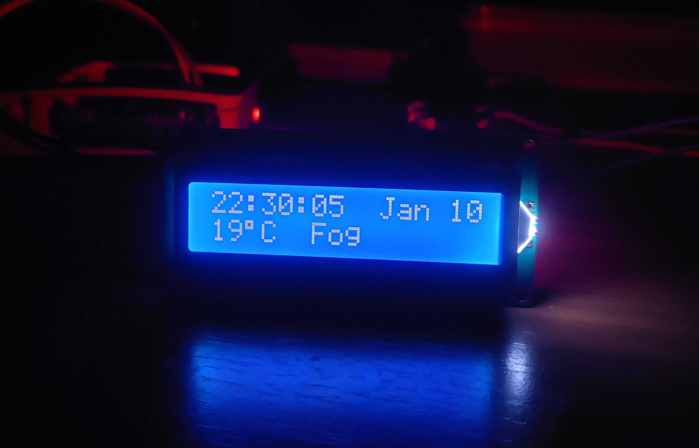

# LCD Dashboard

A simple lcd screen to keep track of Time, Date, Temperature (fetched using a weather API) 

## Things Used
- Raspberry Pi 3 model B
- LCD 16x2 with I2C module
- 10k Potentiometer
- Jumper cables

## Screenshots

<!--  -->

## Acknowledgements

 - [Online Readme Creator](https://readme.so/)
 - [The Raspberry Pi guy](https://github.com/the-raspberry-pi-guy/lcd)
 - [How to write a Good readme](https://bulldogjob.com/news/449-how-to-write-a-good-readme-for-your-github-project)

